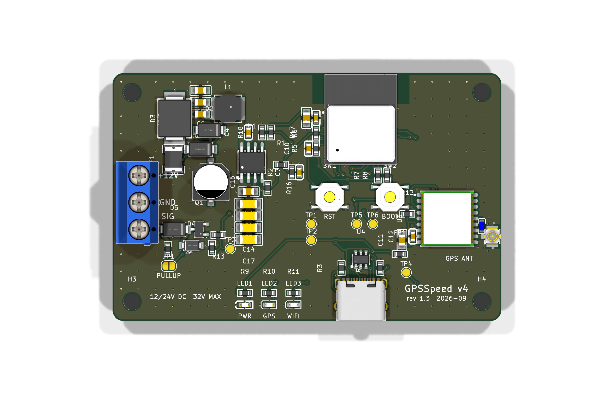

# GPSSpeed: a GPS replacement for the PerfectPass paddlewheel

**A small board that reads GPS speed and feeds it to PerfectPass as if it were the paddlewheel.**
Built for, and being tested on, our **2008 MasterCraft X2**. Everything is open: schematic, PCB,
firmware, and the notes on what didn't work along the way.



## The problem

PerfectPass holds a tow boat at a set speed by reading the boat's **paddlewheel speed sensor**: a
small wheel under the hull that spins in the water and sends one pulse per fraction of a turn.
On our X2 that sensor is part of an Airmar DST800-style triducer (speed, depth, temperature). It
sends about 20,000 pulses per nautical mile, and PerfectPass turns the pulse rate into speed.

Paddlewheels are the weak link:

- **They foul.** Weed, a fishing line, or a little growth, and the wheel drags or stops. PerfectPass
  then sees the wrong speed (or none) and drives the throttle accordingly.
- **They're getting hard to replace.** The DST800 is now an Airmar *legacy* product.
- **They're never quite right.** Paddlewheel speed depends on the wheel, the hull, and how clean it
  is, so the dash and the real speed drift apart.

GPS speed doesn't have any of these problems. So the idea is simple: **read speed from GPS, and
generate the same pulse train the paddlewheel would**, on the same wire. PerfectPass doesn't know
the difference, and nothing else on the boat changes.

## How it works

```
 GPS antenna ──► ATGM336H GPS ──► ESP32-C3 ──► protected low-side switch ──► SIGNAL ──► PerfectPass
                 (10 Hz speed)    (pulse rate =      (open-drain, like the
                                   MPH × 4.42 Hz)     paddlewheel's own output)
 Boat 12 V ──► protection + buck ──► 3.3 V
```

- **Output:** a 50 % square wave whose frequency is proportional to speed: **4.42 Hz per MPH** by
  default (about 22 Hz at 5 MPH, 133 Hz at 30 MPH), calibrated from the phone app. It's generated by
  the ESP32's LEDC hardware timer from the 40 MHz crystal, so it's exact (worst-case 0.02 % error)
  and nothing in software can stretch a pulse.
- **No GPS fix yet:** it holds a steady 5 MPH. It never sweeps, because PerfectPass chases a sweep.
- **Lag compensation:** a small predictor projects speed ~0.3 s ahead from GPS acceleration, so
  PerfectPass isn't correcting late and hunting.
- **Phone app, no app install:** for 2 minutes after power-up the board runs its own WiFi network
  (`GPSSpeed-XXXX`, open). Join it and the app pops up: live speed, satellites, a self-test that
  steps through set speeds, a dash calibration table, settings, and **firmware updates over WiFi**.
  Then the radio turns itself off for the rest of the day on the water. It's also at
  `http://gpsspeed.local` while connected.
- **Wiring:** three screw terminals: **+12 V, GND, SIGNAL**.

## Status (October 2026)

| | |
|---|---|
| Hardware | **Rev 1.3**, 5 boards assembled by JLCPCB. Three external EE review rounds (summarized in [docs/04-design-reviews.md](docs/04-design-reviews.md)). |
| Bench-tested | Power, USB, GPS (13–16 satellites, fix indoors), antenna power, battery sense, phone app, **OTA update from an iPhone**. See [docs/05-bring-up.md](docs/05-bring-up.md). |
| Not yet tested | 12 V boat power, the output against a real PerfectPass input, on-water calibration. |
| Firmware | 4.0.8 (`firmware/gpsspeed_v4/bin/`) |

This is a prototype that hasn't run on the water yet. Read [the safety note](#safety) before
connecting it to a boat.

## 4 spare boards

We built 5 and need 1. **The other 4 are available** to anyone who wants to try this on their own
PerfectPass boat. They're fully assembled and flashed: you add an antenna and three wires. Reply in
the forum thread or open an issue on this repo.

## What you need to install one

The board, a GPS antenna, and three wires to the boat. The full list, with where to get each
cable and adapter, is in **[docs/06-wiring-and-cables.md](docs/06-wiring-and-cables.md)**.

## Repo map

| Path | What's there |
|---|---|
| [docs/](docs/) | The research: problem, history, design, reviews, bring-up, wiring, costs |
| [pcb/](pcb/) | KiCad 10 project, generator scripts, JLCPCB order files, renders. Start with [pcb/README.md](pcb/README.md) |
| [firmware/gpsspeed_v4/](firmware/gpsspeed_v4/) | ESP32-C3 firmware (Arduino core 3.3), prebuilt `.bin` images |
| [firmware/test/](firmware/test/) | Host-side tests of the pulse-generation and calibration math |
| [legacy/arduino-uno/](legacy/arduino-uno/) | The earlier Arduino Uno + perfboard builds (v1–v3) |
| [docs/forum-post.md](docs/forum-post.md) | The short version, for forums |

## Safety

This board changes what your speed control believes the boat is doing, and PerfectPass controls the
throttle. Test it at idle and low speed first. Keep a hand on the throttle, and know how to
disengage PerfectPass. Compare the dash against a phone GPS app before trusting it with a rider
behind the boat. Use it at your own risk; see the license.

## License

MIT (see [LICENSE](LICENSE)) for the firmware, scripts, docs and hardware design files.
