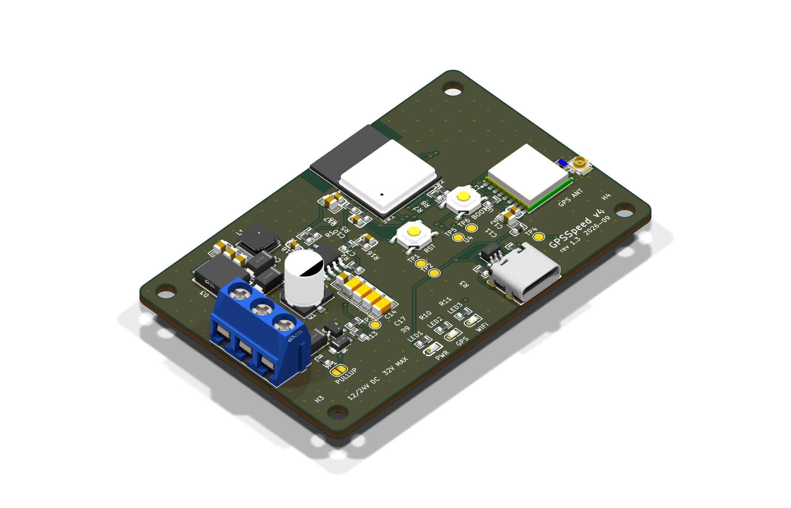

# GPSSpeed v4 — ESP32-C3 board

GPS → paddlewheel pulse emulator for PerfectPass, rebuilt as a JLCPCB-assembled
board. Replaces the Uno + perfboard hat.

| | |
|---|---|
| Size | 72 × 46 mm, 2 layers, 1.6 mm, 4× M3 holes |
| Power | **12/24 V DC nominal, 32 V continuous max.** 60 V polyfuse → 1.5 kW bidirectional TVS (±58 V clamp) → 100 V reverse-polarity Schottky → 22 µF/100 V bulk + 4 × 2.2 µF/100 V → LMR38010 buck (80 V operating, 85 V abs max). USB-C on the bench. |
| Brain | ESP32-C3-MINI-1-H4 (WiFi boot window, OTA updates; 105 °C part) |
| GPS | ATGM336H-5N31 (GPS+BeiDou, 10 Hz), u.FL for the existing active antenna |
| Output | ZXMS6004FF self-protected low-side switch (60 V, current limit, thermal shutdown, active clamp) behind a series Schottky (swapped +12 V/GND can't back-drive the dash), 33 V TVS on the drain; survives SIGNAL wired to +12 V; optional pull-up to the input rail via JP1 (ships **open**) |
| Connector | J1 screw terminal: **1 = +12 V, 2 = GND, 3 = SIGNAL** (wires enter from the board edge) |
| LEDs | PWR (red), GPS (green), WIFI (green) |



## Rev 1.3 — third EE review (independent)

| Review item | Change |
|---|---|
| Stop-ship: SIGNAL wired to +12 V shorts the supply through D5 and a bare 2N7002K the first time Q1 turns on | Q1 → **ZXMS6004FF** IntelliFET: current limit 0.7–1.7 A, thermal shutdown with auto-restart, short-circuit protected to V<sub>DS</sub> 36 V. Specified for 3.3 V logic (V<sub>IH</sub> 3 V, 0.6 Ω max at 3 V) |
| D4 (53 V max clamp) vs Q1 (60 V) margin thin | Q1's own active clamp is 60–70 V / 90 mJ, so a spike past D4 is absorbed by design instead of avalanching a bare MOSFET |
| (follows from the above) | SIGNAL_OUT / SIGNAL_DRAIN routed at **0.5 mm** for the 1.7 A fault current |

Bench items from that review (not schematic errors): output-low level with D5 in series against the real
PerfectPass input; USB-only startup at ~4.6 V into the buck. JP1 stays open on 24 V boats.
Q1 switching: ~15 µs on / ~60 µs off. Constant edge delays leave the output frequency unchanged; duty
shifts by ~1 % at 60 MPH.

## Rev 1.2 — second EE review (reviewed the native KiCad files)

| Review item | Change |
|---|---|
| C16 only 63 V against a 58 V clamp | **22 µF / 100 V**, same series and 6.3 × 7.7 can (RV100V22M6X8) |
| Battery-sense pin reaches 3.6 V at the clamp | R1 150k → **220k** (×23): 32 V reads 1.4 V, the 58 V clamp 2.5 V. Firmware **4.0.2** |
| Input ceramics borderline after DC-bias derating | **4th 2.2 µF / 100 V** (C17) |
| 24 V pull-up would forward-bias D5 and make D4 clamp continuously | Q1 → **2N7002K 60 V**, D4 → **SMF33A** (33 V standoff, 53 V clamp < 60 V) |
| Buck exposed pad: one full paste opening, no thermal path | Paste split into **4 windows (60 %)**; **2 tented GND vias** just past the GND-pin end of the pad; pad tied solid into the pour |
| (found while re-checking) | Two u.FL stitching vias overlapped fanout vias (drill-to-drill). Fanout now avoids existing vias, and drill spacing fails the build |

Not changed: L1 stays where it is (SW node ~8.7 mm total; moving it means relocating D2 in the
packed input corner — the reviewer rated it optional for prototypes). D2 stays an SS310: it has
to block up to ~53 V when USB and boat power are both connected, and USB power is bench-only.

## Rev 1.1 — changes from the external EE review

| Review item | Change |
|---|---|
| "12–24 V" label wrong (old TVS conducted ~20 V) | Input re-rated; silk now reads **12/24V DC 32V MAX** |
| TVS + PTC too close to the AP63203's 35 V abs max | Buck → **LMR38010** (80 V / 85 V abs), TVS → **SMCJ36CA** 1.5 kW bidirectional, PTC → 60 V, D1/D2 → **SS310** 100 V, input ceramics → 100 V, + **47 µF/63 V** bulk |
| L2's 1.2 GHz SRF below GPS L1 | L2 → **Murata LQW18AN27NG** wirewound, SRF 3.7 GHz |
| SIGNAL back-drive on reverse wiring | **D5 SS310 in series** at J1 pin 3 (chosen over a resistor so a stiff head-unit pull-up can't break the low level; adds ~0.3 V) |
| Open via-in-pad under the ESP32 | Removed; also stripped 4 open vias JLC's footprint put in the buck's exposed pad |
| Buck loop / u.FL grounding | Hand-routed C3–VIN–GND loop (~2 mm), SW straight into L1, FB on the quiet side; 8 stitching vias around the u.FL |

Not changed (reviewed and accepted): USB diode-OR (verify startup during WiFi TX on the bench),
reboot on very deep crank dips (firmware ignores brownouts for rollback), SMF15A on the drain
(24.4 V clamp < Q1's 30 V).

**Potting:** keep resin off the ESP32 antenna end (top edge) — resin detunes the PCB antenna.
Leave an air pocket there, or pot only the lower two-thirds of the board.

## What fixes the old problems

- **21 MPH cliff:** gone. The square wave comes from the LEDC hardware peripheral off
  the 40 MHz crystal; no software can stretch it. Measured on the real firmware code:
  worst frequency error **0.02 %** across 1–60 MPH (the Uno drifted up to 2.5 % fast
  at 30 MPH from its 128 µs rounding).
- **One serial port:** the GPS has its own hardware UART; USB-C serial is always free.
- **Tuning at the dock with a laptop:** everything is edited from your phone.

## Files

```
pcb/
  gpsspeed.kicad_pro / .kicad_sch / .kicad_pcb   open in KiCad 10
  gpsspeed.kicad_dru      two scoped DRC exceptions (explained inside)
  lib/                    exact JLC footprints/symbols/3D (easyeda2kicad)
  gen/                    the generators -- design.py is the netlist source of truth
  out/jlcpcb/             gerbers.zip, bom_jlcpcb.csv, cpl_jlcpcb.csv   <- upload these
  out/                    schematic PDF, assembly PDF, STEP, renders
firmware/gpsspeed_v4/     ESP32-C3 firmware; bin/ has prebuilt images
firmware/test/            host-side tests of the pulse + calibration code
```

## Ordering at JLCPCB

1. **PCB:** upload `out/jlcpcb/gerbers.zip`. Defaults are right: 2 layers, 1.6 mm,
   HASL lead-free, green. Qty 5 (the minimum).
2. **PCB Assembly:** on, *Standard*, *Top side*, qty **5**. (Economic won't take
   the ESP32 module -- JLC flags every ESP32-C3-MINI-1 "Standard PCBA only".)
3. Upload `bom_jlcpcb.csv` and `cpl_jlcpcb.csv`.
4. In the **parts review**, every line should match an LCSC number. J1 (screw
   terminal) is through-hole; if Economic won't place it, untick it and solder its
   3 pins by hand.
5. In the **placement preview**, check polarity/pin-1 on: D1–D5, C16 (+), LED1–3, U1–U4, Q1,
   J2, J3. Footprints came from JLC's own library, so rotations should already
   match, but this is the one step a human should eyeball.

Rev 1.1 quote (2026-09-26), for reference: 5 assembled boards $162.84, + UPS ~$37 + US
customs duty ~$61 (JLC collects it up front with DDP shipping) − $10 coupon ≈ $251.

## Bring-up

1. **Before power:** meter +12 V to GND on J1 — must not beep.
2. **USB-C only first.** PWR LED on, TP2 = 3.3 V.
3. Flash once over USB-C:
   ```
   esptool.py --chip esp32c3 write_flash 0x0 firmware/gpsspeed_v4/bin/gpsspeed_v4-4.0.8-usb-full.bin
   ```
   (or `arduino-cli upload` — build command is in `gpsspeed_v4.ino`). If it won't
   connect, hold **BOOT**, tap **RST**, release BOOT.
4. Serial monitor at 115200: expect `chars:` climbing and `ant:OK` once the antenna
   is on. `ant:OPEN` = antenna not connected / passive; `ant:SHORT` = cable fault.
5. Plug in the antenna, go outside, wait for the GPS LED to go solid.
6. **Then** wire the boat: +12 V, GND, SIGNAL to the paddlewheel signal line.

## Using it on the boat

- Power on → join WiFi **`GPSSpeed-XXXX`** (open, no password; XXXX is fixed per board) → the page pops up, tap **Done** → later just open **http://gpsspeed.local**
  (Safari; a captive-portal sheet may open on its own).
- The access point lives **2 minutes** after power-on, extends while your phone is
  connected, then turns the radio off. To get back in: cycle power.
- **Calibrate once:** tap *Self-test*, and at each step type what the dash shows into
  *Dash shows* → *Save point*. One pass gets the dash within ~0.01 MPH at the
  calibrated speeds (tested against a simulated nonlinear dash).
- While GPS is searching the output holds a steady **5 MPH** (never sweeps).
- **Firmware updates:** *Firmware → Upload* the `-ota.bin`. A bad build that
  crash-loops rolls back to the previous one automatically; brownouts from engine
  cranking do not count as crashes.

## Things I could not verify without hardware

- **CASIC config commands** (`$PCAS01/02/03`) follow ZhongKe's documented format. If
  the module ignores one, the firmware still works at its defaults (9600 baud, 1 Hz)
  — the web UI shows the actual baud/rate it achieved.
- **Default Hz/MPH is 4.42**, the Uno's *effective* constant at 15–26 MPH. Expect to
  run the self-test once.
- **Active antenna assumed** (GT-U7 kits ship with one). For a passive antenna,
  remove L2.
- **Wiring polarity:** the board survives +12 V/GND swapped (D5 keeps the swap from
  back-driving the dash input) and SIGNAL wired to +12 V (Q1 current-limits and thermal-cycles).
  Still meter it before powering.
- **JP1 on 24 V boats:** leave it open. Bridged at 28.8 V, R15 (0603) runs near its 0.1 W
  rating; the dash's own pull-up is the normal case anyway.

## Regenerating

```
cd pcb/gen
~/Applications/KiCad/KiCad.app/Contents/Frameworks/Python.framework/Versions/3.9/bin/python3 gen_sch.py
~/Applications/KiCad/KiCad.app/Contents/Frameworks/Python.framework/Versions/3.9/bin/python3 build.py   # place, route, pour, DRC
python3 gen_outputs.py                                                                                  # JLC files
```
`build.py` needs Freerouting (`~/Applications/freerouting`) and Java ≥ 25
(`brew install openjdk`). Edit `design.py` for circuit changes, `gen_pcb.py` for
placement.
